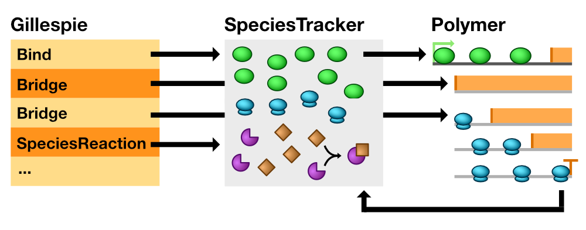
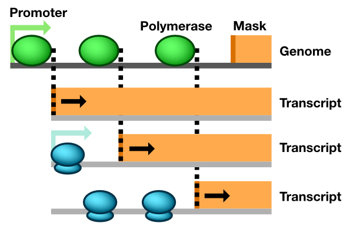

Design and Implementation
=========================

The purpose of this document is to describe, at a conceptual level, the internal structure and logic of Pinetree. If any sections seem confusing or unclear, please file an issue on GitHub.

Stochastic Simulation Algorithm
-------------------------------

Pinetree employs the `Gillespie Stochastic Model Algorithm (SSA) <https://en.wikipedia.org/wiki/Gillespie_algorithm>`_ to model all molecular interactions involved in gene expression, including the movement of individual polymerases on DNA and ribosomes on mRNA. In the SSA, we consider all molecular interactions as reactions, extending from a parent Reaction class. The Gillespie class contains the core components of the SSA. The Gillespie SSA is defined as follows:

1. **Initialize**. Begin with time :math:`t = 0`. Specify free species and assign them a copy number. Specify a set of reactions and reaction rate constants involving the free species.
2. **Compute propensities**. For all reactions in the system compute the propensity of the reaction occurring. Sum over all propensities for all reactions to get the total propensity. 
3. **Generate random numbers**. Based on the individual propensities computed in step 2, randomly select a reaction to occur from all reactions in the system. Using the sum of all propensities, :math:`\tau`, compute the time that the next reaction is expected to occur.
4. **Execute**. Execute the reaction from step 4, and advance the time :math:t by :math:`\tau`.
5. **Iterate**. Repeat steps 2--5 until :math:`t` exceeds some predefined end time of the simulation.

Pinetree follows these steps, while defining several specialized reactions that provide single-molecule tracking of polymerases and ribosomes along DNA and mRNA. We will now describe these specialized reactions, and each step of the SSA, in more detail.

Pooled species-level reactions
------------------------------

An abstract Reaction class is the parent class of all reactions in the SSA. Gillespie maintains a vector of all reactions in the SSA, and they must inherit from Reaction (:numref:`bridge`).

.. _bridge:

   Relationship between Model, SpeciesTracker, and individual Polymer objects. Upon execution, the Bind reaction constructs a Polymerase on a Polymer and removes one copy from SpeciesTracker. A Bridge reaction bypasses SpeciesTracker entirely and signals an individual Polymer to move a Polymerase. When a Polymerase reaches a Terminator, the parent Polymer destroys the Polymerase object and increases the copy number count of that Polymerase type in SpeciesTracker. Lastly, SpeciesReaction objects interact only with pooled species in SpeciesTracker.

To comply with the SSA framework, all reactions must be capable of three actions: calculating their propensity (Step 2) and executing (Step 4). SpeciesReaction implements a standard SSA reaction. SpeciesReaction defines a set of products, a set of reactants, and a rate constant, and computes its propensity from the copy numbers of interacting species and a rate constant. The SSA requires a mesoscopic rate constant, which differs from a macroscopic rate constant typical of deterministic models in that it depends on the reaction volume. SpeciesReaction converts macroscopic rate constants to mesoscopic rate constants internally. Thus the same rate constants from deterministic models can be used directly to parameterize Pinetree simulations. 

Upon execution, SpeciesReaction increments its product counts and decrements the reactant counts. Pinetree only supports coefficients of one for reactants. Product coefficients can be any value greater than zero. SpeciesReaction objects themselves do not maintain counts of molecular species. All molecular species in Pinetree simulation run are tracked by a single instance of SpeciesTracker. SpeciesTracker also maintains species-to-SpeciesReaction maps. This allows Gillespie to cache propensities, and only update the propensities of reactions whose products or reactants have just changed.

Individual molecule-level reactions
-----------------------------------

At the single-molecule level, Polymer objects track individual Polymerases as they move along the polymer, detecting collisions and determining when the Polymerase should leave the Polymer. Tracking RNA polymerases on a genome and ribosomes on mRNA transcripts share enough similarities that most of transcription and translation logic is defined in a generic Polymer class. In practice, a Pinetree Model object uses the child classes Genome and Transcript, described in later sections. Ribosomes and RNA polymerases differ only in the definition of their member variables (e.g. footprint size, movement rate, step size, and binding interactions) and are thus represented only by the Polymerase class. Likewise, promoters and ribosome binding sites are represented by a single Promoter class and terminators and stop codons by a single Terminator class. The remainder of this section describes the Polymer, Polymerase, Promoter, and Terminator classes generically.

Pinetree defines two specialized reactions that differ from SpeciesReaction to handle single-molecule tracking. The first are called Bind reactions. Bind reactions coordinate the transfer of a Polymerases from the pooled species level to an individual Polymer object. Bind reactions are specific for each type Promoter-Polymerase binding interaction. Bind treats all exposed Promoters as a pooled species. Upon execution of the Bind reaction, Bind randomly selects a Polymer that contains an open Promoter with which to bind. It constructs a new Polymerase, then instructs the Polymer to bind the Polymerase to an open Promoter. SpeciesTracker maintains Promoter-to-Polymer maps. This map allows all components of Pinetree to quickly look up which Polymers contain a given Promoter. 

The second type of specialized single-molecule reactions are called Wrapper reactions. Wrapper reactions are thin wrappers around individual Polymers. Every individually modeled Polymer has an associated Wrapper reaction. The Wrapper reaction requests a total propensity value from its Polymer. Upon execution, it instructs the Polymer to move one of its Polymerases.

Polymer
^^^^^^^

Each Polymer object maintains a vector of Polymerase objects attached to the Polymer, ordered by position. Each Polymerase defines a fixed speed, in base pairs per second, of movement. Each Polymer also maintains a vector of scaling factors representing every base in the Polymer. To simulate codons that are translated at different speeds, Polymer computes position-specific movement rates. To compute the scaled movement rates for all Polymerase objects, the movement rate of Polymerase is multiplied by a scaling factor corresponding to the position of the Polymer. These scaled movement rates correspond exactly to SSA propensities. Thus, the sum of these propensities represent the overall propensity of the Polymer, i.e., a value proportional to the probability of any single Polymerase moving along the Polymer. This overall propensity is reported to Gillespie, which tracks all Polymers via Wrapper reactions. If Gillespie selects a Wrapper reaction to execute corresponding to a given Polymer, that Polymer must then choose which Polymerase to move.  To move a Polymerase, the Polymer again takes the scaled movement rates (propensities) and selects a Polymerase randomly, weighted by its propensity. The Polymer attempts to move that Polymerase one position forward. 

Polymer checks for several interactions before Polymerase movement is finalized. First, it checks for a collision with a downstream Polymerase objects by comparing coordinates of the newly-moved Polymerase an upstream Polymerase. If the coordinates overlap, a collision has a occurred. The newly-moved Polymerase moves back to its original starting position, and the current SSA iteration ends. If no collision occurs, Polymer compares the coordinates of the newly-moved Polymerase with that of any upstream Terminator, Promoter, or Mask objects. If the Polymerase overlaps with Terminator, the Polymer verifies that the Polymerase interacts with the Terminator. To simulate readthrough, the Polymer randomly generates a number between 0 and 1. If this value is larger than the the readthrough probability of the Terminator, the Polymer finalizes the movement of Polymerase  and sets a readthrough flag. This readthrough flag stops Polymer from repeatedly verifying Terminator-Polymerase interactions as the Polymerase moves over the terminator during future SSA iterations. Once Polymerase clears the Terminator completely, Polymer resets the readthrough flag. If no readthrough occurs, Polymer terminates Polymerase by removing the object from the vector of Polymerase objects. The Polymer recomputes its total propensity and fires a termination signal to other components of the simulation. This termination signal varies for Genome and Transcript described below.

If Polymerase overlaps with a Promoter, Polymer marks that Promoter as covered and inaccessible. Once Polymerase clears the Promoter, Polymer marks the Promoter as accessible again. Polymer maintains a vector of unbound Promoter objects, and SpeciesTracker maintains a map of which Promoter objects bind to which Polymerase objects. The Polymer reports to SpeciesTracker and Gillespie the number of unbound Promoter objects. If the Model determines that a Polymerase should bind to a Promoter, the Polymer randomly selects the appropriate Promoter to bind, and the polymerase is added to the vector of Polymerases at the Promoter object's position. The newly-bound Polymerase is now ready to move on the Polymer.

Lastly, Polymerase objects may interact with Mask objects upon moving. Each Polymer may have a single Mask object. The Mask objects makes portions of the Polymer inaccessible to Polymerases. Polymer treats the Mask as a large Polymerase that may cover the entire Polymer. Upon Polymerase movement, if the Polymerase collides with a Mask, the Polymerase may move back one step, or the Mask may recede. Which of these two interactions occurs depends on the specific Mask and Polymerase, and these interactions differ for Genome and Transcript objects. 

Genome and Transcript
^^^^^^^^^^^^^^^^^^^^^

The Genome and Transcript classes are specialized versions of the parent Polymer class (:numref:`polymer`). 

.. _polymer:

   
   Single molecule tracking in Pinetree. When a Polymerase binds to a Promoter, it immediately generates a Transcript object with a Mask. As the Polymerase moves, the Mask object retracts, exposing Promoters on the Transcripts. Dashed lines represent signals between Polymerase and Mask objects.

A Genome object has a vector member variable that defines a complete transcript template. When a polymerase binds to a promoter, it immediately generates a complete Transcript object based on the transcript template. The newly-generated Transcript object contains genes corresponding to where the polymerase bound and extending to the end of the genome. Upon binding, the polymerase creates a Mask covering the entire Transcript, except for the very 5' end. As the polymerase moves forward from this promoter in the 5'-to-3' direction on the Genome object, the polymerase signals to the Transcript to shift the 5'-end of Mask one base pair towards the 3'-end, thus exposing more of the Transcript. This unmasking process simulates transcript synthesis. Moreover, the length of the transcript, corresponding to the position of the mask, can be determined dynamically as the simulation progresses. The termination position of the transcript does not need to be specified upon promoter binding.

The Mask in a Transcript is inaccessible to ribosomes. Ribosomes, represented by Polymerase objects, collide with the Mask in much the same way that they collide with each other. A ribosome colliding with a Mask simulates ribosomes colliding with an RNA polymerase that is actively synthesizing the transcript on which the ribosome is translating. If a ribosome collides with a Mask, the ribosome stalls, just as if it had collided with another ribosome.

A Genome may also define a Mask. This Mask makes portions of the Genome inaccessible to polymerase binding. However, some polymerases are capable of shifting the mask upon colliding with it. This shifting simulates some viral genomes in which a polymerase itself pulls the genome into a cell as it transcribes.

FixedElements
-------------

FixedElement objects are defined as any fixed element along a Polymer. These include promoters, terminators, ribosome binding sites, and stop codons. FixedElement objects may interact with any number of different types of Polymerases. They are also capable of being covered by a Polymerase and thus inaccessible. All FixedElement objects differ from Polymerase and Mask objects in that they have fixed stop and start coordinates. 

Signaling mechanisms
--------------------

A Signal class provides a standardized interface for communication between different objects in Pinetree. For example, when a Polymerase moves it may signal to a transcript Mask that it should also move. When a ribosome reaches a stop codon, it signals to SpeciesTracker that a termination event has occurred and new protein must be added to the species pool. The Signal class follows a signals and slots'' model. Some objects carry their own Signal objects. Any function from any object may register with the Signal and occupy one of the Signal slots. These slots represent listeners. An object may then fire a Signal object, transmitting signals to any number of listeners without knowing how such signals will be handled when they reach the listener. This encapsulation allows portions of the simulation to be tested independently from one another.

